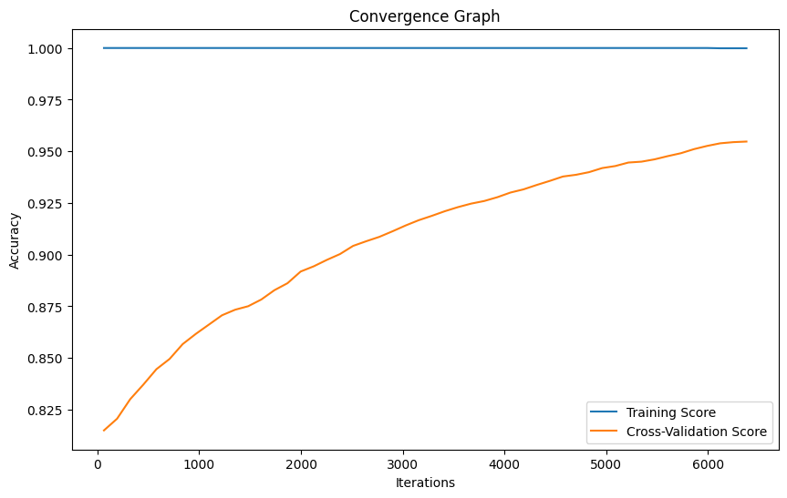

# Parameter Optimisation

## Dataset
The dataset used in this project is sourced from the UCI Machine Learning Repository. You can access the dataset [here](https://archive.ics.uci.edu/ml/datasets/Room+Occupancy+Estimation).

**Dataset Details:**
- Number of Instances: 10,129
- Number of Attributes: 16

## Problem Statement
The goal of this project is to accurately estimate the number of occupants in a room using non-intrusive environmental sensors. The attributes in the dataset include temperature, light, sound, CO2 levels, and PIR (Passive Infrared) sensor readings.

## Approach
The SVM algorithm is employed for multi-variate classification using the dataset attributes. Hyperparameter tuning is performed by adjusting parameters such as kernel type, C (regularization parameter), and gamma to optimize model performance.

## Results
| Sample | Best Accuracy | Best Kernel | Best Nu | Best Epsilon |
|--------|---------------|-------------|---------|--------------|
| 0      | 0.91          | linear      | 2.34    | 1.11         |
| 1      | 0.95          | linear      | 7.07    | 9.54         |
| 2      | 0.92          | poly        | 2.86    | 4.06         |
| 3      | 0.94          | poly        | 1.55    | 9.45         |
| 4      | 0.96          | poly        | 1.94    | 7.72         |
| 5      | 0.97          | rbf         | 8.51    | 0.14         |
| 6      | 0.93          | linear      | 8.28    | 8.02         |
| 7      | 0.95          | linear      | 6.32    | 8.46         |
| 8      | 0.95          | poly        | 9.30    | 6.05         |
| 9      | 0.82          | poly        | 4.61    | 5.89         |
| 10     | 0.82          | poly        | 4.61    | 5.89         |

## Convergence Graph
